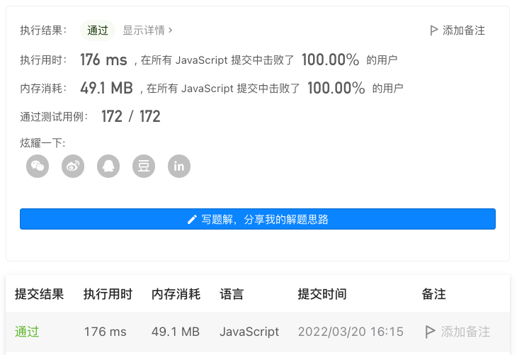

# 第 74 场双周赛

## 比赛地址

[比赛地址](https://leetcode-cn.com/contest/biweekly-contest-74/)

## 第二题 6021. 字符串中最多数目的子字符串

## 题目描述
[题目地址](https://leetcode-cn.com/problems/maximize-number-of-subsequences-in-a-string/)
> 给你一个下标从 0 开始的字符串 text 和另一个下标从 0 开始且长度为 2 的字符串 pattern ，两者都只包含小写英文字母。
>
> 你可以在 text 中任意位置插入 一个 字符，这个插入的字符必须是 pattern[0] 或者 pattern[1] 。注意，这个字符可以插入在 text 开头或者结尾的位置。
>
> 请你返回插入一个字符后，text 中最多包含多少个等于 pattern 的 子序列 。
>
> 子序列 指的是将一个字符串删除若干个字符后（也可以不删除），剩余字符保持原本顺序得到的字符串。

示例 1:

> 输入：text = "abdcdbc", pattern = "ac"
>
> 输出：4
> 
> 解释：
> 
> 如果我们在 text[1] 和 text[2] 之间添加 pattern[0] = 'a' ，那么我们得到 "abadcdbc" 。那么 "ac" 作为子序列出现 4 次。
其他得到 4 个 "ac" 子序列的方案还有 "aabdcdbc" 和 "abdacdbc" 。
但是，"abdcadbc" ，"abdccdbc" 和 "abdcdbcc" 这些字符串虽然是可行的插入方案，但是只出现了 3 次 "ac" 子序列，所以不是最优解。
可以证明插入一个字符后，无法得到超过 4 个 "ac" 子序列。

示例 2:
> 输入：text = "aabb", pattern = "ab"
> 
> 输出：6
> 
> 解释：
> 可以得到 6 个 "ab" 子序列的部分方案为 "aaabb" ，"aaabb" 和 "aabbb" 。

## 思路

最大值一定在以下两种情况：
- `pattern[0]`放在字符串首
- `pattern[1]`放在字符串尾
然后分别计算两种情况数量取最大即可。

```
    function count(text, a, b) {
        let bCount = 0;

        for (let i = 0; i < text.length; i++) {
            if (text[i] === b) {
                bCount++;
            }
        }

        if (a === b) {
            return bCount * (bCount - 1) / 2;
        }

        let result = 0;
        let preACount = 0;
        for (let i = 0; i < text.length; i++) {
            if (text[i] === a) {
                result += bCount;
                preACount++;
            }
            if (text[i] === b) {
                result += preACount;
                bCount--;
            }
        }

        // 重复计算一遍
        return result / 2;
    }

    return Math.max(
        count(pattern[0] + text, pattern[0], pattern[1]),
        count(text + pattern[1], pattern[0], pattern[1]),
    )
```

## 结果
