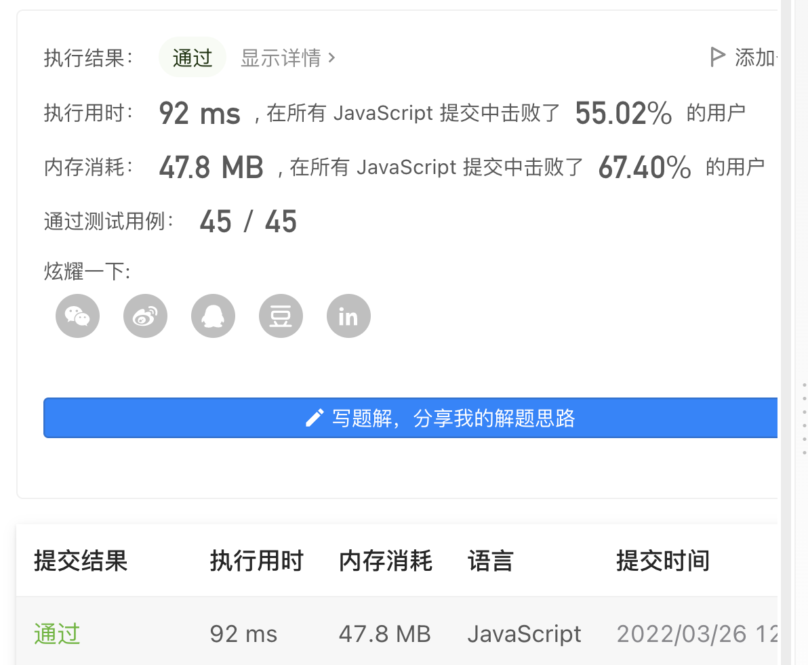

# 面试金典系列 - 面试题 02.07. 链表相交

## 题目描述
[题目地址](https://leetcode-cn.com/problems/intersection-of-two-linked-lists-lcci/)

> 给你两个单链表的头节点 headA 和 headB ，请你找出并返回两个单链表相交的起始节点。如果两个链表没有交点，返回 null 。

## 思路

### 
```
    // 2->6->4->null->1->5->null
    // 1->5->null->2->6->4->null

    let _headA = headA;
    let _headB = headB;

    while (_headA !== _headB) {
        _headA = _headA ? _headA.next : headB;
        _headB = _headB ? _headB.next : headA;
    }
    return _headA;
```

### 结果

