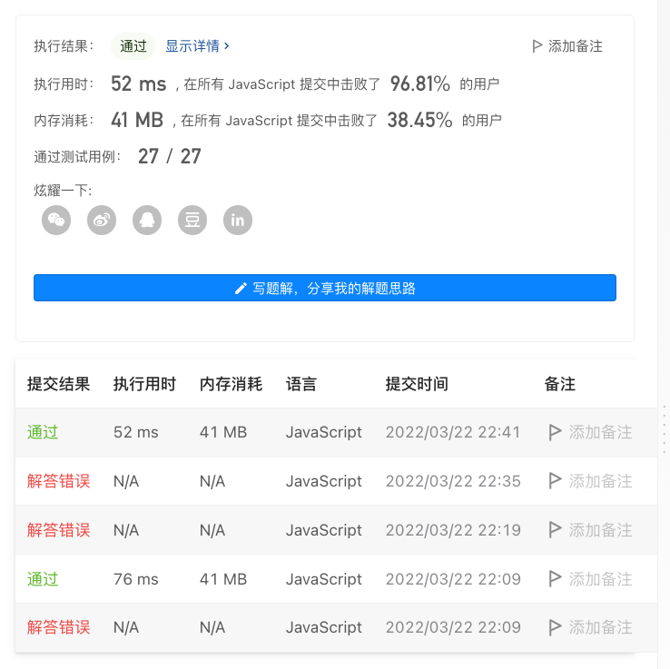

# 面试金典系列 - 面试题 01.04. 回文排列

## 题目描述
[题目地址](https://leetcode-cn.com/problems/palindrome-permutation-lcci/)

> 给定一个字符串，编写一个函数判定其是否为某个回文串的排列之一。
> 
> 回文串是指正反两个方向都一样的单词或短语。排列是指字母的重新排列。
>
> 回文串不一定是字典当中的单词。

示例 1:

> 输入："tactcoa"
> 
> 输出：true（排列有"tacocat"、"atcocta"，等等）


## 思路

### 遍历
```
    let map = {};

    for (let i = 0; i < s.length; i++) {
        if (map[s[i]]) {
            map[s[i]]++;
        } else {
            map[s[i]] = 1;
        }
    }

    return Object.values(map).filter(item => item % 2 === 1).length <= 1;
```
### 位运算 js位不够可以分组

```
    let result = [];

    for (let i = 0; i < s.length; i++) {
        const code = s[i].charCodeAt();
        result[Math.ceil(code / 31)] ^= (1 << (code % 31))
    }

    return result.every(item => (item & (item - 1)) === 0)
```

### 结果

