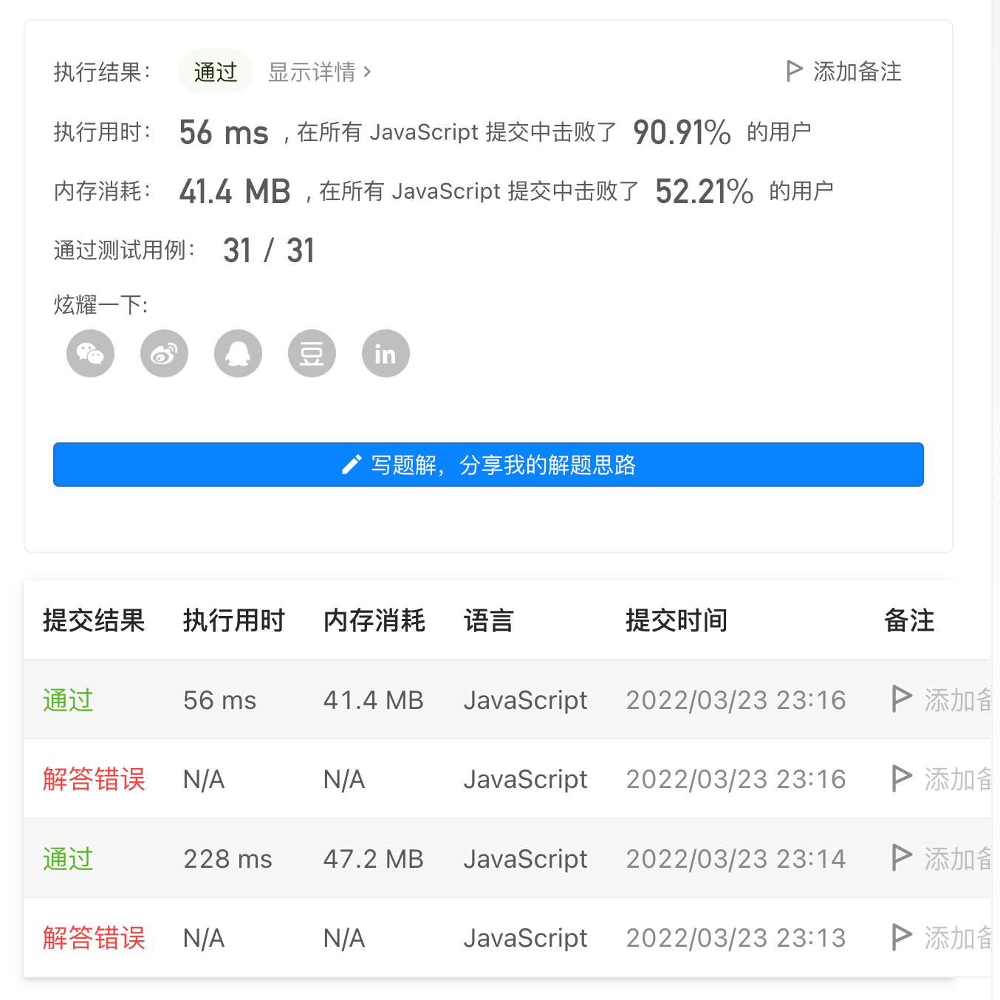

# 面试金典系列 - 面试题 01.09. 字符串轮转

## 题目描述
[题目地址](https://leetcode-cn.com/problems/palindrome-permutation-lcci/)

> 字符串轮转。给定两个字符串s1和s2，请编写代码检查s2是否为s1旋转而成（比如，waterbottle是erbottlewat旋转后的字符串）。

示例 1:

> 输入：s1 = "waterbottle", s2 = "erbottlewat"
> 
> 输出：True

示例 2:

> 输入：s1 = "aa", s2 = "aba"
>
> 输出：False

## 思路

### 遍历 旋转、比较
```
    if (s1.length !== s2.length) {
        return false;
    }
    if (s1 === '') {
        return true;
    }

    let len = s1.length;
    let times = 0;

    while (times <= s1.length) {
        s2 = s2.slice(1, len + 1) + s2[0];
        if (s2 === s1) {
            return true;
        }
        times++;
    }

    return false;
```
### 简便思路

```
    if (s1.length !== s2.length) {
        return false;
    }
    return (s2 + s2).includes(s1);
```

### 结果

