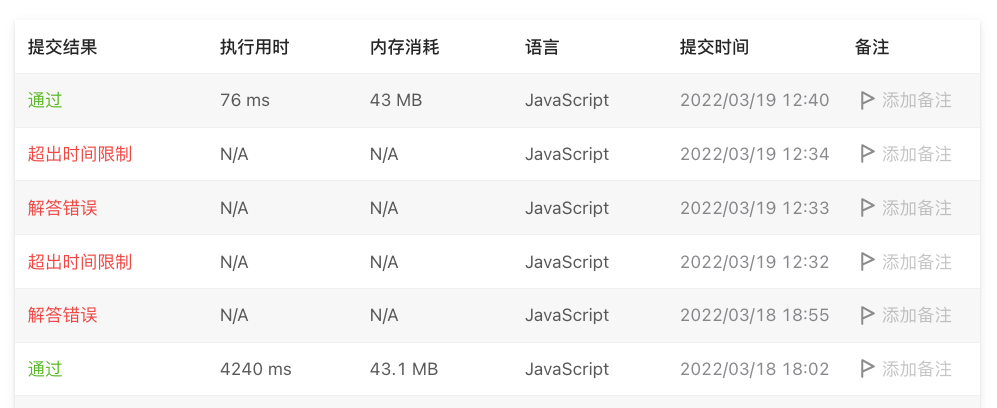

# 剑指offer系列

## 题目描述
[题目地址](https://leetcode-cn.com/problems/xoh6Oh/)
> 给定两个整数 a 和 b ，求它们的除法的商 a/b ，要求不得使用乘号 '*'、除号 '/' 以及求余符号 '%' 。

> 
> 注意：
> 
> - 整数除法的结果应当截去（truncate）其小数部分，例如：truncate(8.345) = 8 以及 truncate(-2.7335) = -2
>
> - 假设我们的环境只能存储 32 位有符号整数，其数值范围是 [−231, 231−1]。本题中，如果除法结果溢出，则返回 231 − 1

示例 1:

> 输入：a = 15, b = 2
> 
> 输出：7
> 
> 解释：15/2 = truncate(7.5) = 7

示例 2:
> 输入：a = 7, b = -3
> 
> 输出：-2
>
> 解释：7/-3 = truncate(-2.33333..) = -2


## 思路

### 累加或递减

`a`不断减`b`直到结果小于0，记录递减次数即可

```
    if (a === -Math.pow(2, 31) && b === -1) {
        return -(a + 1);
    }

    let result = 0;
    let flag = (a > 0 && b < 0) || (a < 0 && b > 0);
    if (a < 0) a = -a;
    if (b < 0) b = -b;

    if (b === 1) {
        result = a;
    } else {
        while (a >= b) {
            a -= b;
            result++;
        }
    }

    return flag ? -result : result;
```

### 位运算

```
    let result = 0;
    let cacheB = b;

    while (a >= cacheB) {
        let b = cacheB;
        let _result = 1;
        while (b << 1 <= a && b << 1 > 0) {
            b = b << 1;
            _result *= 2;
        }
        a -= b;
        result += _result
    }

    return flag ? -result : result;
```

### 结果
位运算时间复杂度为O(log n)比累加迭代的O(n)

