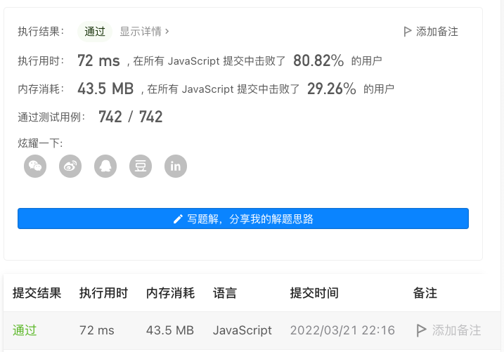

# 剑指offer系列 - 剑指 Offer II 012. 左右两边子数组的和相等

## 题目描述
[题目地址](https://leetcode-cn.com/problems/tvdfij/)
> 给你一个整数数组 nums ，请计算数组的 中心下标 。
> 
> 数组 中心下标 是数组的一个下标，其左侧所有元素相加的和等于右侧所有元素相加的和。
> 
> 如果中心下标位于数组最左端，那么左侧数之和视为 0 ，因为在下标的左侧不存在元素。这一点对于中心下标位于数组最右端同样适用。
>
> 如果数组有多个中心下标，应该返回 最靠近左边 的那一个。如果数组不存在中心下标，返回 -1 。

示例 1:

> 输入：nums = [1,7,3,6,5,6]
>
> 输出：3
> 
> 解释：
> 
> 中心下标是 3 。
> 
> 左侧数之和 sum = nums[0] + nums[1] + nums[2] = 1 + 7 + 3 = 11 ，
> 
> 右侧数之和 sum = nums[4] + nums[5] = 5 + 6 = 11 ，二者相等。

示例 2:

> 输入：nums = [1, 2, 3]
> 
> 输出：-1
> 
> 解释：
> 
> 数组中不存在满足此条件的中心下标。

## 思路

### 计算总和，从左到右遍历

```
    let sum = nums.reduce((pre, cur) => pre + cur, 0);

    let lSum = 0;

    for (let i = 0; i < nums.length; i++) {
        if ((sum - nums[i]) / 2 === lSum) {
            return i;
        } else {
            lSum += nums[i];
        }
    }

    return -1;
```

### 结果

