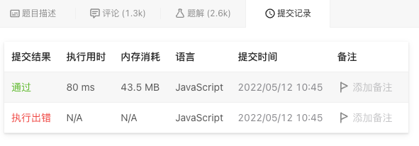

# 142. 环形链表 II

## 题目描述
[题目地址](https://leetcode.cn/problems/linked-list-cycle-ii/)
> 给定一个链表的头节点  head ，返回链表开始入环的第一个节点。 如果链表无环，则返回 null。
>
> 如果链表中有某个节点，可以通过连续跟踪 next 指针再次到达，则链表中存在环。 为了表示给定链表中的环，评测系统内部使用整数 pos 来表示链表尾连接到链表中的位置（索引从 0 开始）。如果 pos 是 -1，则在该链表中没有环。注意：pos 不作为参数进行传递，仅仅是为了标识链表的实际情况。
>
> 不允许修改 链表。


示例 1:

> 输入：head = [3,2,0,-4], pos = 1
> 
> 输出：返回索引为 1 的链表节点
> 
> 解释：链表中有一个环，其尾部连接到第二个节点。

示例 2:
> 输入：numbers = [2,3,4], target = 6
> 
> 输出：[1,3]
> 
> 解释：2 与 4 之和等于目标数 6 。因此 index1 = 1, index2 = 3 。返回 [1, 3] 。


## 思路

### 布伦特算法
```
    if (!head) {
        return head;
    }
    
    let slow = head;
    let fast = head.next;
    let power = 1;
    let length = 1;

    while (fast && fast !== slow) {
        if (power !== length) {
            fast = fast.next;
            length++;
        } else {
            power *= 2;
            length = 0;
            slow = fast;
            fast = fast.next;
        }
        if (length === 0) {
            length++;
        }
    }

    if (!fast) {
        return fast;
    }

    slow = fast = head;
    while (length--) {
        fast = fast.next;
    }
    while (slow !== fast) {
        slow = slow.next;
        fast = fast.next;
    }

    return slow;
```


### 结果

