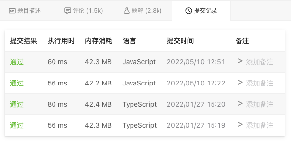

# 167. 两数之和 II - 输入有序数组

## 题目描述
[题目地址](https://leetcode.cn/problems/two-sum-ii-input-array-is-sorted/)
> 给你一个下标从 1 开始的整数数组 numbers ，该数组已按 非递减顺序排列  ，请你从数组中找出满足相加之和等于目标数 target 的两个数。如果设这两个数分别是 numbers[index1] 和 numbers[index2] ，则 1 <= index1 < index2 <= numbers.length 。
>
> 以长度为 2 的整数数组 [index1, index2] 的形式返回这两个整数的下标 index1 和 index2。
>
> 你可以假设每个输入 只对应唯一的答案 ，而且你 不可以 重复使用相同的元素。
>
> 你所设计的解决方案必须只使用常量级的额外空间。

示例 1:

> 输入：numbers = [2,7,11,15], target = 9
> 
> 输出：[1,2]
> 
> 解释：2 与 7 之和等于目标数 9 。因此 index1 = 1, index2 = 2 。返回 [1, 2] 。


示例 2:
> 输入：numbers = [2,3,4], target = 6
> 
> 输出：[1,3]
> 
> 解释：2 与 4 之和等于目标数 6 。因此 index1 = 1, index2 = 3 。返回 [1, 3] 。


## 思路

### 双指针
```
    // 双指针
    // 由于已排序，使用逆向左右双指针
    // sum 大于 target 右指针左移
    // sum 小于 target 左指针右移

    let left = 0;
    let right = numbers.length - 1;

    while (numbers[left] + numbers[right] !== target) {
        if (numbers[left] + numbers[right] > target) {
            right--;
        } else if (numbers[left] + numbers[right] < target) {
            left++;
        }
    }
    return [left + 1, right + 1];
```


### 结果

