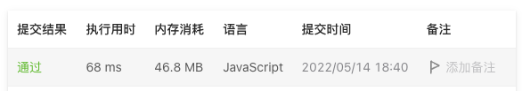

# 680. 验证回文字符串 Ⅱ

## 题目描述
[题目地址](https://leetcode.cn/problems/valid-palindrome-ii/)
> 给定一个非空字符串 s，最多删除一个字符。判断是否能成为回文字符串。

示例 1:

> 输入: s = "aba"
> 
> 输出: true

示例 2:
> 输入: s = "abca"
>
> 输出: true
> 
> 解释: 你可以删除c字符。


## 思路

### 双指针 + 递归
```
    let times = 0;

    const _validPalindrome = (s, left, right) => {
        while (left < right) {
            if (s[left] === s[right]) {
                left++;
                right--;
            } else {
                times++;
                if (times > 1) {
                    return false
                } 
                return _validPalindrome(s, left, right - 1) || _validPalindrome(s, left + 1, right)
            }
        }

        return true;
    }

    return _validPalindrome(s, 0, s.length - 1);
```


### 结果

