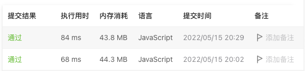

# 76. 最小覆盖子串

## 题目描述
[题目地址](https://leetcode.cn/problems/minimum-window-substring/)
> 给你一个字符串 s 、一个字符串 t 。返回 s 中涵盖 t 所有字符的最小子串。如果 s 中不存在涵盖 t 所有字符的子串，则返回空字符串 "" 。
> 
> 注意：
>
> 对于 t 中重复字符，我们寻找的子字符串中该字符数量必须不少于 t 中该字符数量。
> 
> 如果 s 中存在这样的子串，我们保证它是唯一的答案。


示例 1:

> 输入：s = "ADOBECODEBANC", t = "ABC"
> 
> 输出："BANC"

示例 2:
> 输入：s = "a", t = "a"
> 
> 输出："a"


## 思路

### 双指针
```
    let left = 0;
    let right = 0;
    let result = null;

    // t里含有的对应某一个字符数量 与 当前区间内对应字符的数量 的差
    // t ‘ABC’ A：1   假设当前字符串 ‘DDA’ A：1    tMap.A === 0
    // t ‘ABC’ A：1   假设当前字符串 ‘DXX’ A：0    tMap.A === 1
    // t ‘ABC’ A：1   假设当前字符串 ‘ADA’ A：2    tMap.A === -1

    let tMap = {};

    for (let i = 0; i < t.length; i++) {
        if (tMap[t[i]]) {
            tMap[t[i]]++;
        } else {
            tMap[t[i]] = 1;
        }
    }
    // sum 代表全部 上述字符差 的和  
    // 为0证明当前字符串已经包含了t
    // 大于0证明缺少字符
    // 小于0说明冗余
    let sum = t.length;

    while (right < s.length || sum === 0) {
        
        if (sum === 0) {
            if (!result || (right - left < result.length)) {
                result = s.substring(left, right + 1);
            }
            if (left === right) {
                right++;
                left++;
                sum = t.length;
                continue;
            }
            // 不在t内
            if (tMap[s[left]] === undefined) {
                left++;
                continue;
            }
            // 缩小区间时，大于0 真的是缺少那个字符 sum才累加
            if (tMap[s[left]] >= 0) {
                sum++;
            }
            tMap[s[left]]++;
            left++;
        } else {
            // 不在t内
            if (tMap[s[right]] === undefined) {
                right++;
                continue;
            }
            if (tMap[s[right]] > 0) {
                sum--;
            }
            tMap[s[right]]--;
        }
        if (sum !== 0) {
            right++;
        }
    }

    return result || '';
```


### 结果

