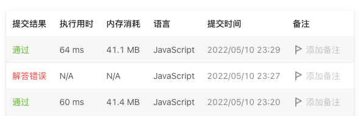

# 88. 合并两个有序数组

## 题目描述
[题目地址](https://leetcode.cn/problems/merge-sorted-array/)
> 给你两个按 非递减顺序 排列的整数数组 nums1 和 nums2，另有两个整数 m 和 n ，分别表示 nums1 和 nums2 中的元素数目。
>
> 请你 合并 nums2 到 nums1 中，使合并后的数组同样按 非递减顺序 排列。
>
> 注意：最终，合并后数组不应由函数返回，而是存储在数组 nums1 中。为了应对这种情况，nums1 的初始长度为 m + n，其中前 m 个元素表示应合并的元素，后 n 个元素为 0 ，应忽略。nums2 的长度为 n 。


示例 1:

> 输入：nums1 = [1,2,3,0,0,0], m = 3, nums2 = [2,5,6], n = 3
> 
> 输出：[1,2,2,3,5,6]
> 
> 解释：需要合并 [1,2,3] 和 [2,5,6] 。
> 
> 合并结果是 [1,2,2,3,5,6] ，其中斜体加粗标注的为 nums1 中的元素。


## 思路

### 双指针
```
    // 从右向左便遍历放置
    let index1 = m - 1;
    let index2 = n - 1;
    let i = nums1.length - 1;

    while (i >= 0 && index2 >= 0) {
        if (nums1[index1] >= nums2[index2]) {
            nums1[i] = nums1[index1];
            index1--;
        } else {
            nums1[i] = nums2[index2];
            index2--;
        }
        i--;
    }
```


### 结果

